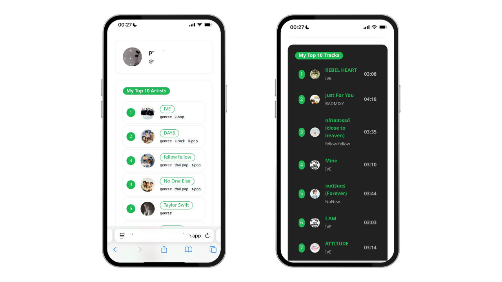
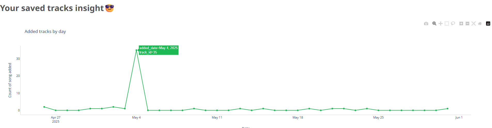
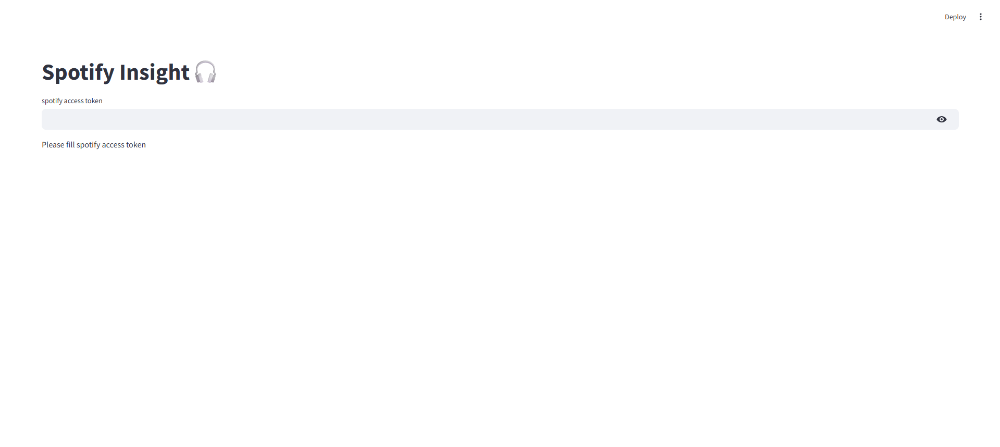

# My Spotify insight🎧

This repository is my tiny web app project that will provide us with our spotify listening habits insight using **python, flask, jinja (with a little bit HTML/CSS), streamlit, plotly and spotify web API** to get spotify data, analyse, and display insight. This was built from desire of knowing my music listening behavior by not just waiting for official SpotifyWrapped at the end of each year. 







## Features
- **Authentication** : request access to get spotify data from user.
- **User Profile** : display user profile image, display name, and id
- **Top Artists** : display user top artists in past 6 months.
- **Top Tracks** : display user top songs in past 6 months.
- **Added tracks by day**: display total songs that you saved to library by day using line chart.

<!-- ### To be develop
- get all song from user playlist ( to analyse their behavior)
- get all playlists -->


## Requirements

- spotify account (which you use for listening music)
- add `.env` to run this project
    ```  
    SPOTIFY_CLIENT_ID=YOUR_SPOTIFY_CLIENT_ID
    SPOTIFY_CLIENT_SECRET=YOUR_SPOTIFY_CLIENT_SECRET
    REDIRECT_URI=YOUR_REDIRECT_URI 
    ```
<!-- - spotify `client id` and `client secret` -->


## Examples
  
This project can run on both `streamlit` (with user input access token) or using `flask` with spotify authentication interface.


#### Using `streamlit`

1. get spotify access token and keep to enter on streamlit. (can close this after keep spotify access token)
    ```
    python test_login.py
    ```

2. run streamlit to get spotify insight
    ```
    streamlit run streamlit_app.py
    ```

3. enter access token 
   
   


#### Using `flask`

- run `flask_home`
   ```
   python flask_home.py
   ```
