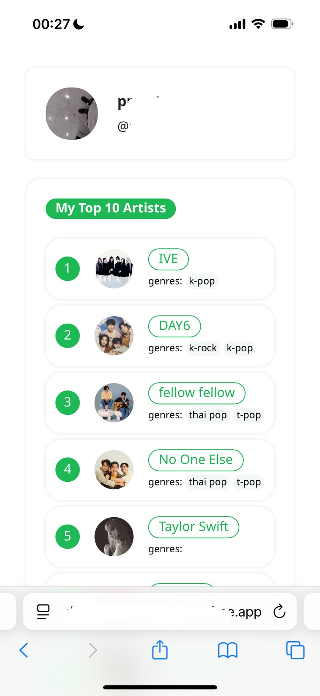

# My Spotify insight🎧

This project is my tiny web app that will provide users with their Spotify listening habits insight using **python, flask, jinja (with a little bit HTML/CSS), and spotify web API** to get spotify data, analyse, and display insight. This was built from desire of knowing my music listening behavior by not just waiting for official SpotifyWrapped at the end of each year. 

### Key features
- **Authentication** : request access to get spotify data from user.
- **User Profile** : display user profile image, display name, and id
- **Top Artists** : display user top artists in past 6 months.
   
   
- **Top Tracks** : display user top songs in past 6 months.

### To be develop
- get all song from user playlist ( to analyse their behavior)
- get all playlists
